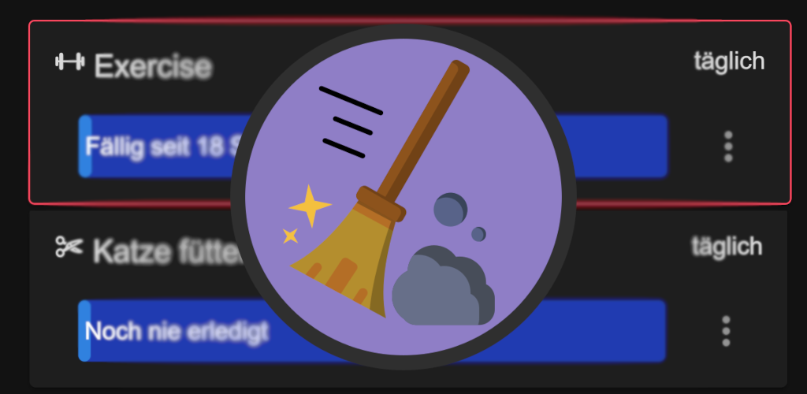
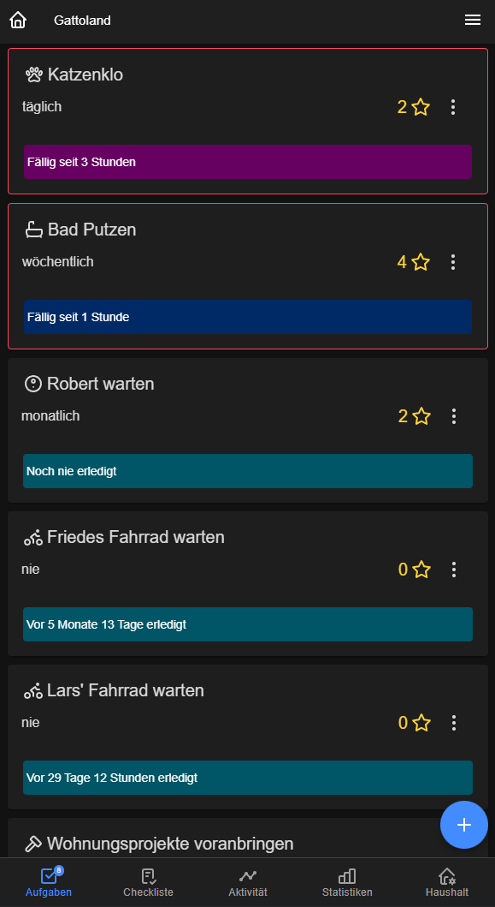
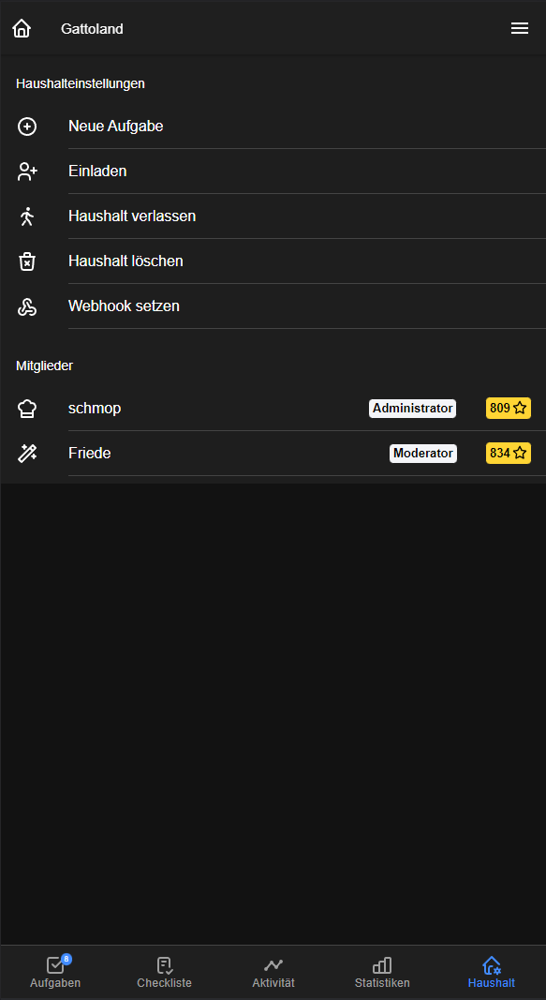
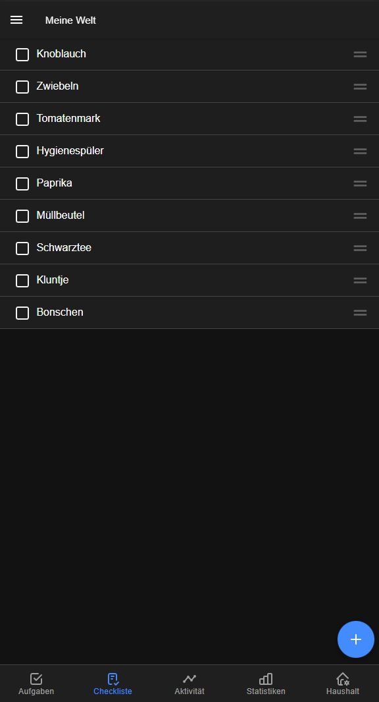

# Cleanly - The organizational tool for your shared spaces



This repository contains the [web-version](https://schmoppo.de/), [Android-App](https://play.google.com/store/apps/details?id=de.schmoppo.cleanly) and iOS-App of Cleanly.
The backend-services are published under [schmop/cleanly-server](https://github.com/schmop/cleanly-server).

## Features

Cleanly is based on Users, coming together in a shared *Household*.

### Tasks
Recurring _tasks_ may help your cleaning schedules, getting reminders to feed your pets, not forget to buy groceries in time or to do sportly activities.



You can receive push-notifications
* when tasks are due or
* when others finished a task (and appreciate one another!)

### Stars
Gamify your tasks by giving them _stars_!
Then after being competitive about the cleaning in your household for a while, you can compare your star-count ;)



### Checklists
_Checklists_ help you collect, order and remind yourselves on collaborative lists. This can be a grocery list or a watch list for tv shows!



## Development

### Installing dependencies
You need to install the [Ionic CLI Framework](https://ionicframework.com/docs/cli).
Then install the dependencies using:
```
yarn
```

### Type-Guards
When changing or adding types that have automatically-generated type-guards (using [ts-auto-guard](https://github.com/rhys-vdw/ts-auto-guard), use this to re-generate the type-guards:
```
npx ts-auto-guard
```

### Check for missing translations
```
npm run translations
```

### Starting the dev-server

Create a dev-server using:
```
ionic serve
```
It will tell you your local ip aswell, please change `getDevHostIp()` in `client/src/client/host.ts`.

## Enabling Firebase-Cloud-Messaging in Android-Apps

Add the google-services.json in `android/app/google-services.json` with the configuration of your Firebase-Account.
For more information, see https://firebase.google.com/docs/android/setup#add-config-file.

## Debug in Android Studio

First build the assets for dev:
```
npm run build:dev
npm run sync:dev
```
Then open the android project using:
```
npx cap open android
```

## Building the APK

To build the android app for production, please use:
```
npm run build
npm run sync
npx cap open android
```

Then build, test and bundle using Android Studio!

## Changelogs

Can be found here: https://cleanly.schmoppo.de/changelog